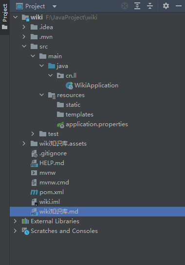

# 搭建SpringBoot项目

## 1. 新建SpringBoot项目

### 1.1 创建项目选择Spring Initializr填写项目信息


### 1.2 勾选需要的依赖创建项目


### 1.3 SpringBoot目录结构




**.idea: ** idea设置配置目录，idea特有，如果使用eclipse则没有该目录。

**.mvn:**  maven的配置目录，一般用不到，本地环境使用idea自带的maven。

**src: ** 项目目录，所有的代码存放在该目录下。

**WikiApplication: ** 项目启动入口。

**resources:**  静态资源存放目录。

**application.properties: ** 项目配置文件。

**test: ** 项目测试目录。

**wiki知识库.assets:**  wiki学习笔记图片目录

**.gitignore:**  git提交忽略文件配置。

**HELP.md:**   帮助文档。

**wiki.iml:**  项目工程配置文件。

**mvnw:**  maven配置文件，对应linux命令。

**mvnw.cmd:**  maven配置文件，对应windows命令。

**pom.xml:**  Maven管理文件，所有依赖都是通过这个文件进行管理的。

**wik知识库：** wiki学习笔记

**External Libraries:** 项目依赖。

### 1.4. 修改Spring Boot版本号

打开pom.xml文件进行修改：

```xml
<parent>
    <groupId>org.springframework.boot</groupId>
    <artifactId>spring-boot-starter-parent</artifactId>
    <version>2.4.0</version>
    <relativePath/>
</parent>

```


## 2. 项目初始配置

### 2.1 编码配置

在IDEA左上角点击File -> settings，找到File Encodings，把所有可以更改UTF-8的地方全部改为UTF-8。


### 2.2 JDK配置

打开File -> Project Structure


### 2.3 Maven配置

#### 2.3.1 创建repository

在Maven目录中创建repository文件夹，该文件夹用来存放Maven下载的库文件。

#### 2.3.2 修改配置

打开config/settings.xml文件

- 修改第55行的标签内容，为本地电脑repository文件夹的路径：

```xml
<localRepository>G:\maven\repository</localRepository>

```

- 第160行~177行，已经配置好了阿里云仓库。Maven会自动从阿里云仓库下载Java项目依赖的库文件。如果不设置阿里云仓库，Maven会自动从国外服务器下载依赖库文件，速度会很慢：

```xml
<mirror>
	<id>alimaven</id>
    <name>aliyun maven</name>
    <url>http://maven.aliyun.com/nexus/content/groups/public/</url>
    <mirrorOf>central</mirrorOf>
</mirror>
<mirror>
    <id>alimaven</id>
    <mirrorOf>central</mirrorOf>
    <name>aliyun maven</name>
    <url>http://maven.aliyun.com/nexus/content/repositories/central/</url>
</mirror>
<mirror>
    <id>repo2</id>
    <mirrorOf>central</mirrorOf>
    <name>Human Readable Name for this Mirror.</name>
    <url>http://repo2.maven.org/maven2/</url>
</mirror>

```

#### 2.3.3 在IDEA中修改配置

启动IDEA，打开Settings找到Maven，将选项和你本地的目录一一对应：


### 2.4 git配置

顶部工具栏找到VCS->Enable Version Control Intergration 然后选择git


随后项目目录颜色就发生了变化：


红色表示还没有交给git进行管理。


在IDEA左下角选择Commit，这时候发现有文件没有交给git进行管理：


这时候我们可以右键选择Add to VCS：


这样文件就会交给git进行管理了，文件也会变成绿色。

我们可以选中所有文件，在下方Commit Message填写想要提交的信息单击Commit就可以进行提交了。


### 2.5 使用IDEA连接Github

在IDEA打开File->Settings，找到Github：


单击+，选择log in via github在浏览器中点击即可。


点击顶部Git -> Github -> Share project on Github


点击share即可在github创建同名远程库。

在IDEA中Ctrl+Shift+k即可调出push界面，点击push可以将本地仓库的代码上传到远程仓库。

## 3. 启动日志优化

### 3.1 logback日志样式修改

在resources目录下增加logback-spring.xml文件：

```xml
<?xml version="1.0" encoding="UTF-8"?>
<configuration>
    <!-- 修改一下路径-->
    <property name="PATH" value="./log"></property>

    <appender name="STDOUT" class="ch.qos.logback.core.ConsoleAppender">
        <encoder>
            <!--            <Pattern>%d{yyyy-MM-dd HH:mm:ss.SSS} %highlight(%-5level) %blue(%-50logger{50}:%-4line) %thread %msg%n</Pattern>-->
            <Pattern>%d{ss.SSS} %highlight(%-5level) %blue(%-30logger{30}:%-4line) %thread %msg%n</Pattern>
        </encoder>
    </appender>

    <appender name="TRACE_FILE" class="ch.qos.logback.core.rolling.RollingFileAppender">
        <file>${PATH}/trace.log</file>
        <rollingPolicy class="ch.qos.logback.core.rolling.TimeBasedRollingPolicy">
            <FileNamePattern>${PATH}/trace.%d{yyyy-MM-dd}.%i.log</FileNamePattern>
            <timeBasedFileNamingAndTriggeringPolicy class="ch.qos.logback.core.rolling.SizeAndTimeBasedFNATP">
                <maxFileSize>10MB</maxFileSize>
            </timeBasedFileNamingAndTriggeringPolicy>
        </rollingPolicy>
        <layout>
            <pattern>%d{yyyy-MM-dd HH:mm:ss.SSS} %-5level %-50logger{50}:%-4line %green(%-18X{LOG_ID}) %msg%n</pattern>
        </layout>
    </appender>

    <appender name="ERROR_FILE" class="ch.qos.logback.core.rolling.RollingFileAppender">
        <file>${PATH}/error.log</file>
        <rollingPolicy class="ch.qos.logback.core.rolling.TimeBasedRollingPolicy">
            <FileNamePattern>${PATH}/error.%d{yyyy-MM-dd}.%i.log</FileNamePattern>
            <timeBasedFileNamingAndTriggeringPolicy class="ch.qos.logback.core.rolling.SizeAndTimeBasedFNATP">
                <maxFileSize>10MB</maxFileSize>
            </timeBasedFileNamingAndTriggeringPolicy>
        </rollingPolicy>
        <layout>
            <pattern>%d{yyyy-MM-dd HH:mm:ss.SSS} %-5level %-50logger{50}:%-4line %green(%-18X{LOG_ID}) %msg%n</pattern>
        </layout>
        <filter class="ch.qos.logback.classic.filter.LevelFilter">
            <level>ERROR</level>
            <onMatch>ACCEPT</onMatch>
            <onMismatch>DENY</onMismatch>
        </filter>
    </appender>

    <root level="ERROR">
        <appender-ref ref="ERROR_FILE" />
    </root>

    <root level="TRACE">
        <appender-ref ref="TRACE_FILE" />
    </root>

    <root level="INFO">
        <appender-ref ref="STDOUT" />
    </root>
</configuration>
```

在.gitignore文件中把log目录添加，以避免日志文件上传远程仓库：

```
/log/
```

### 3.2 修改启动文案

在启动类WikiApplication中添加启动成功日志：


在application.properties中添加一下代码：

```properties
# SpringBoot启动端口
server.port=8080
```

这样项目在启动的时候就会弹出启动成功显示端口号：


### 3.2 修改启动图案

自定义图案，在resources目录中新增banner.txt文件。

在线生成文字图案：http://patorjk.com/software/taag

将生成的文字图案粘贴在txt文件中即可。

例如：

```
                    _ooOoo_
                   o8888888o
                   88" . "88
                   (| -_- |)
                   O\  =  /O
                ____/`---'\____
              .'  \\|     |//  `.
             /  \\|||  :  |||//  \
            /  _||||| -:- |||||-  \
            |   | \\\  -  /// |   |
            | \_|  ''\---/''  |   |
            \  .-\__  `-`  ___/-. /
          ___`. .'  /--.--\  `. . __
       ."" '<  `.___\_<|>_/___.'  >'"".
      | | :  `- \`.;`\ _ /`;.`/ - ` : | |
      \  \ `-.   \_ __\ /__ _/   .-` /  /
 ======`-.____`-.___\_____/___.-`____.-'======
                    `=---='
^^^^^^^^^^^^^^^^^^^^^^^^^^^^^^^^^^^^^^^^^^^^^
              Buddha Bless, No Bug !
```

项目启动后图案就会修改：


