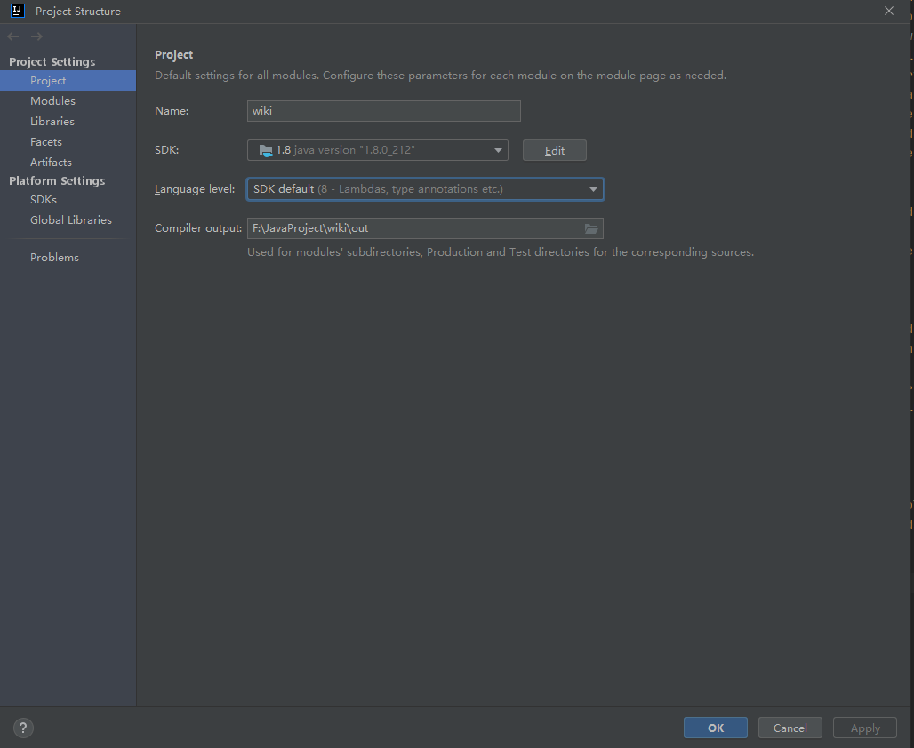
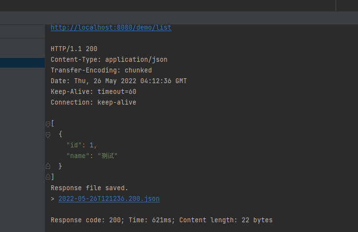

# 搭建SpringBoot项目

## 1. 新建SpringBoot项目

### 1.1 创建项目选择Spring Initializr填写项目信息


### 1.2 勾选需要的依赖创建项目


### 1.3 SpringBoot目录结构


**.idea: ** idea设置配置目录，idea特有，如果使用eclipse则没有该目录。

**.mvn:**  maven的配置目录，一般用不到，本地环境使用idea自带的maven。

**src: ** 项目目录，所有的代码存放在该目录下。

**WikiApplication: ** 项目启动入口。

**resources:**  静态资源存放目录。

**application.properties: ** 项目配置文件。

**test: ** 项目测试目录。

**wiki知识库.assets:**  wiki学习笔记图片目录

**.gitignore:**  git提交忽略文件配置。

**HELP.md:**   帮助文档。

**wiki.iml:**  项目工程配置文件。

**mvnw:**  maven配置文件，对应linux命令。

**mvnw.cmd:**  maven配置文件，对应windows命令。

**pom.xml:**  Maven管理文件，所有依赖都是通过这个文件进行管理的。

**wik知识库：** wiki学习笔记

**External Libraries:** 项目依赖。

### 1.4. 修改Spring Boot版本号

打开`pom.xml`文件进行修改：

```xml
<parent>
    <groupId>org.springframework.boot</groupId>
    <artifactId>spring-boot-starter-parent</artifactId>
    <version>2.4.0</version>
    <relativePath/>
</parent>

```


## 2. 项目初始配置

### 2.1 编码配置

在IDEA左上角点击`File -> settings`，找到`File Encodings`，把所有可以更改`UTF-8`的地方全部改为`UTF-8`。


### 2.2 JDK配置

打开`File -> Project Structure`




### 2.3 Maven配置

#### 2.3.1 创建repository

在`Maven`目录中创建`repository`文件夹，该文件夹用来存放`Maven`下载的库文件。

#### 2.3.2 修改配置

打开`config/settings.xml`文件

- 修改第55行的标签内容，为本地电脑`repository`文件夹的路径：

```xml
<localRepository>G:\maven\repository</localRepository>

```

- 第160行~177行，已经配置好了阿里云仓库。Maven会自动从阿里云仓库下载Java项目依赖的库文件。如果不设置阿里云仓库，Maven会自动从国外服务器下载依赖库文件，速度会很慢：

```xml
<mirror>
	<id>alimaven</id>
    <name>aliyun maven</name>
    <url>http://maven.aliyun.com/nexus/content/groups/public/</url>
    <mirrorOf>central</mirrorOf>
</mirror>
<mirror>
    <id>alimaven</id>
    <mirrorOf>central</mirrorOf>
    <name>aliyun maven</name>
    <url>http://maven.aliyun.com/nexus/content/repositories/central/</url>
</mirror>
<mirror>
    <id>repo2</id>
    <mirrorOf>central</mirrorOf>
    <name>Human Readable Name for this Mirror.</name>
    <url>http://repo2.maven.org/maven2/</url>
</mirror>

```

#### 2.3.3 在IDEA中修改配置

启动IDEA，打开`Settings`找到`Maven`，将选项和你本地的目录一一对应：


### 2.4 git配置

顶部工具栏找到`VCS->Enable Version Control Intergration` 然后选择git


随后项目目录颜色就发生了变化：


红色表示还没有交给git进行管理。


在IDEA左下角选择`Commit`，这时候发现有文件没有交给git进行管理：


这时候我们可以右键选择`Add to VCS`：


这样文件就会交给git进行管理了，文件也会变成绿色。

我们可以选中所有文件，在下方`Commit Message`填写想要提交的信息单击`Commit`就可以进行提交了。


### 2.5 使用IDEA连接Github

在IDEA打开`File->Settings`，找到Github：


单击+，选择`log in via github`在浏览器中点击即可。


点击顶部`Git -> Github -> Share project on Github`


点击`share`即可在github创建同名远程库。

在IDEA中Ctrl+Shift+k即可调出push界面，点击push可以将本地仓库的代码上传到远程仓库。

## 3. 启动日志优化

### 3.1 logback日志样式修改

在`resources`目录下增加`logback-spring.xml`文件：

```xml
<?xml version="1.0" encoding="UTF-8"?>
<configuration>
    <!-- 修改一下路径-->
    <property name="PATH" value="./log"></property>

    <appender name="STDOUT" class="ch.qos.logback.core.ConsoleAppender">
        <encoder>
            <!--            <Pattern>%d{yyyy-MM-dd HH:mm:ss.SSS} %highlight(%-5level) %blue(%-50logger{50}:%-4line) %thread %msg%n</Pattern>-->
            <Pattern>%d{ss.SSS} %highlight(%-5level) %blue(%-30logger{30}:%-4line) %thread %msg%n</Pattern>
        </encoder>
    </appender>

    <appender name="TRACE_FILE" class="ch.qos.logback.core.rolling.RollingFileAppender">
        <file>${PATH}/trace.log</file>
        <rollingPolicy class="ch.qos.logback.core.rolling.TimeBasedRollingPolicy">
            <FileNamePattern>${PATH}/trace.%d{yyyy-MM-dd}.%i.log</FileNamePattern>
            <timeBasedFileNamingAndTriggeringPolicy class="ch.qos.logback.core.rolling.SizeAndTimeBasedFNATP">
                <maxFileSize>10MB</maxFileSize>
            </timeBasedFileNamingAndTriggeringPolicy>
        </rollingPolicy>
        <layout>
            <pattern>%d{yyyy-MM-dd HH:mm:ss.SSS} %-5level %-50logger{50}:%-4line %green(%-18X{LOG_ID}) %msg%n</pattern>
        </layout>
    </appender>

    <appender name="ERROR_FILE" class="ch.qos.logback.core.rolling.RollingFileAppender">
        <file>${PATH}/error.log</file>
        <rollingPolicy class="ch.qos.logback.core.rolling.TimeBasedRollingPolicy">
            <FileNamePattern>${PATH}/error.%d{yyyy-MM-dd}.%i.log</FileNamePattern>
            <timeBasedFileNamingAndTriggeringPolicy class="ch.qos.logback.core.rolling.SizeAndTimeBasedFNATP">
                <maxFileSize>10MB</maxFileSize>
            </timeBasedFileNamingAndTriggeringPolicy>
        </rollingPolicy>
        <layout>
            <pattern>%d{yyyy-MM-dd HH:mm:ss.SSS} %-5level %-50logger{50}:%-4line %green(%-18X{LOG_ID}) %msg%n</pattern>
        </layout>
        <filter class="ch.qos.logback.classic.filter.LevelFilter">
            <level>ERROR</level>
            <onMatch>ACCEPT</onMatch>
            <onMismatch>DENY</onMismatch>
        </filter>
    </appender>

    <root level="ERROR">
        <appender-ref ref="ERROR_FILE" />
    </root>

    <root level="TRACE">
        <appender-ref ref="TRACE_FILE" />
    </root>

    <root level="INFO">
        <appender-ref ref="STDOUT" />
    </root>
</configuration>
```

在`.gitignore`文件中把`log`目录添加，以避免日志文件上传远程仓库：

```
/log/
```

### 3.2 修改启动文案

在启动类`WikiApplication`中添加启动成功日志：


在`application.properties`中添加一下代码：

```properties
# SpringBoot启动端口
server.port=8080
```

这样项目在启动的时候就会弹出启动成功显示端口号：


### 3.3 修改启动图案

自定义图案，在`resources`目录中新增`banner.txt`文件。

在线生成文字图案：http://patorjk.com/software/taag

将生成的文字图案粘贴在txt文件中即可。

例如：

```
                    _ooOoo_
                   o8888888o
                   88" . "88
                   (| -_- |)
                   O\  =  /O
                ____/`---'\____
              .'  \\|     |//  `.
             /  \\|||  :  |||//  \
            /  _||||| -:- |||||-  \
            |   | \\\  -  /// |   |
            | \_|  ''\---/''  |   |
            \  .-\__  `-`  ___/-. /
          ___`. .'  /--.--\  `. . __
       ."" '<  `.___\_<|>_/___.'  >'"".
      | | :  `- \`.;`\ _ /`;.`/ - ` : | |
      \  \ `-.   \_ __\ /__ _/   .-` /  /
 ======`-.____`-.___\_____/___.-`____.-'======
                    `=---='
^^^^^^^^^^^^^^^^^^^^^^^^^^^^^^^^^^^^^^^^^^^^^
              Buddha Bless, No Bug !
```

项目启动后图案就会修改：


## 4. 开发Hello World接口

1.  创建 `cn.ll.controller`包
2.  在 `cn.ll.controller`包下创建`TestController`类

```java
package cn.ll.controller;

import org.springframework.web.bind.annotation.RequestMapping;
import org.springframework.web.bind.annotation.RestController;

/**
 * @author liuli
 */
//@Controller
@RestController
public class TestController {

//  @RequestMapping("/hello")
    @GetMapping("/hello")
    public String hello(){
        return "Hello World!";
    }

}

```

运行启动类`WikiApplication.java`在浏览器输入localhost:8080/hello即可访问接口：


- @RestController注解用于声明返回文本数据，可以返回字符串或者JSON
- @Controller注解用于声明返回的界面（前后端分离项目基本用不到）
- @Controller + @ResponseBody = @RestController

Controller层是用于定义接口的，是请求的入口。

常见的HTTP请求：GET POST PUT DELETE

GET：查询

POST：新增

PUT：修改

DELETE：删除

对应的注解：

- @GetMapping
- @PostMapping
- @PutMapping
- @DeleteMapping

如果使用@RequestMapping注解，则表示这个接口支持所有的请求方式。

@GetMapping("/hello")

等价于

@RequestMapping(value="/hello", Method=RequestMethod.GET)

## 5. 更改启动类位置

1. 创建 `cn.ll.config` 包

2. 将`LiuWikiApplication.java`移动到该包下。

3. 添加`@ComponentScan`注解标注路径。以下是启动类：

   ```java
   package cn.ll.config;
   
   import org.slf4j.Logger;
   import org.slf4j.LoggerFactory;
   import org.springframework.boot.SpringApplication;
   import org.springframework.boot.autoconfigure.SpringBootApplication;
   import org.springframework.context.annotation.ComponentScan;
   import org.springframework.core.env.Environment;
   
   @ComponentScan("cn.ll")
   @SpringBootApplication
   public class LiuWikiApplication {
   
       private static final Logger LOG = LoggerFactory.getLogger(LiuWikiApplication.class);
   
       public static void main(String[] args) {
           SpringApplication app = new SpringApplication(LiuWikiApplication.class);
           Environment env = app.run(args).getEnvironment();
           LOG.info("启动成功！！");
           LOG.info("地址: \thttp://127.0.0.1:{}", env.getProperty("server.port"));
       }
   
   }
   
   ```

   

`@SpringBootApplication`注解包含`@ComponentScan`注解，而`@ComponentScan`注解只会扫描当前类下的包以及子包，扫描不到Controller层，所以更改启动类的位置需要重新填写需要扫描的路径。

需要注意的是，扫描的路径不要太通用，例如要扫描`com.xx`而不是`com`，如果单纯扫描`com`，会把第三方`jar`里的类扫描出来。

## 6. 使用IDEA自带的HTTP Client测试接口

1. 创建 `http` 包
2. 新建一个`File`，名称可以随意，后缀必须为`http`，例如：test.http。

以下是实例：

test.http

```
GET http://localhost:8080/hello
Accept: application/json


###
```

控制台会输出返回到的Hello World！


`HTTP Client`支持结果验证：

```
GET http://localhost:8080/hello
#Accept: application/json

> 
###

POST http://localhost:8080/hello/post
Content-Type: application/x-www-form-urlencoded

name=TEST

###
```


## 7. SpringBoot配置文件

`SpringBoot`会自动识别下面这组配置文件：
application.properties/yml
config/application.properties/yml

如果是`SpringCloud`，还会自动识别下面这组配置文件：
bootstrap.properties/yml
config/bootstrap.properties/yml


配置文件优先级：

yml文件>properties

config目录下配置优先于其父目录。


自定义配置项：

在配置文件中定义：

```
test.hello = hello
```

在要读取的地方加上`@Value`注解即可读取。

```java
package cn.ll.controller;

import org.springframework.beans.factory.annotation.Value;
import org.springframework.web.bind.annotation.GetMapping;
import org.springframework.web.bind.annotation.PostMapping;
import org.springframework.web.bind.annotation.RequestMapping;
import org.springframework.web.bind.annotation.RestController;

/**
 * @author liuli
 */
//@Controller
@RestController
public class TestController {

    @Value("${test.hello}")
    private String testHello;

//  @RequestMapping("/hello")
    @GetMapping("/hello")
    public String hello(){
        return "Hello World!" + testHello;
    }

    @PostMapping("/hello/post")
    public String helloPost(String name) {
        return "Hello World! Post，" + name;
    }

}

```

`@Value`支持默认值写法：

```
    @Value("${test.hello:test}")

```

如果配置文件中没有定义配置项，则显示默认值test，如果存在自定义配置项，则为配置项中的内容。

## 8. SpringBoot集成热部署

1. 引入依赖包，在`pom.xml`文件中添加：

   ```xml
    <dependency>
               <groupId>org.springframework.boot</groupId>
               <artifactId>spring-boot-devtools</artifactId>
           </dependency>
   ```

   SpringBoot内置的依赖不需要添加版本号

2. 开启静态自动编译，打开右上角`File->Settings`，找到`Compiler`，勾选上 `Build project automatically` :

3. 开启自动编译，开启静态自动编译，打开右上角`File->Settings`，找到 `Advanced Settings`，勾选`Allow auto-make to start even if developed application is currently running`


# 后端架构完善与接口开发

## 1. IDEA数据库插件配置

右侧栏找到`Database`，点击加号，选择`Data Source->Mysql`:


填写地址以及用户名密码和所选数据库：


随后点击`Test Connection`，第一次需要下载相关驱动。

测试连接成功后点击ok即可。

新建测试表：

```sql
drop table if exists `test`;
create table `test` (
  `id` bigint not null comment 'id',
  `name` varchar(50) comment '名称',
  `password` varchar(50) comment '密码',
  primary key (`id`)
) engine=innodb default charset=utf8mb4 comment='测试';
```

全选运行即可执行：


在项目根目录新建doc文件夹，然后新建 `all.sql` 文件用来存放数据库脚本：

```sql
drop table if exists `test`;
create table `test` (
        `id` bigint not null comment 'id',
        `name` varchar(50) comment '名称',
        `password` varchar(50) comment '密码',
        primary key (`id`)
) engine=innodb default charset=utf8mb4 comment='测试';
```

以后需要修改数据库信息可以在这里面填写sql语句执行，不需要切屏到数据库操作软件，很方便。

## 2. 集成持久层框架Mybatis

### 2.1 添加依赖

在`pom.xml`中添加依赖：

```xml
   <!-- 集成mybatis-->
        <dependency>
            <groupId>org.mybatis.spring.boot</groupId>
            <artifactId>mybatis-spring-boot-starter</artifactId>
            <version>2.1.3</version>
        </dependency>
        <!-- 集成mysql连接 -->
        <dependency>
            <groupId>mysql</groupId>
            <artifactId>mysql-connector-java</artifactId>
            <version>8.0.22</version>
        </dependency>
```

### 2.2 配置数据源

在`application.properties`中添加数据库连接：

```properties
# 增加数据库连接
spring.datasource.url=jdbc:mysql://localhost:3306/wiki?characterEncoding=UTF8&autoReconnect=true&serverTimezone=Asia/Shanghai
spring.datasource.username=root
spring.datasource.password=Hlsdzpdw123
spring.datasource.driver-class-name=com.mysql.cj.jdbc.Driver
```


### 2.3. Mybatis示例

#### 2.3.1 创建实体类

在`cn.ll`目录下新建 `domain` 包，创建 `Test` 实体类

```java
package cn.ll.domain;

/**
 * @author liu
 */
public class Test {

    private String name;

    private Integer id;

    private String password;

    public String getName() {
        return name;
    }

    public void setName(String name) {
        this.name = name;
    }

    public Integer getId() {
        return id;
    }

    public void setId(Integer id) {
        this.id = id;
    }

    public String getPassword() {
        return password;
    }

    public void setPassword(String password) {
        this.password = password;
    }
}

```

#### 2.3.2 新建mapper包

在`cn.ll`目录下新建`mapper`包，创建`TestMapper`接口，在启动类中添加注解

`TestMapper.java`：

```java
package cn.ll.mapper;

import cn.ll.domain.Test;

import java.util.List;

public interface TestMapper {
    public List<Test> list();
}

```

在启动类中添加`@MapperScan`注解：

```java
@MapperScan("cn.ll.mapper")

```

`@MapperScan`作用：指定要变成实现类的接口所在的包，然后包下面的所有接口在编译之后都会生成相应的实现类。


#### 2.3.3 mapper映射文件

在`resources`目录下新建`mapper`目录，新建`TestMapper.xml`:

```xml
<?xml version="1.0" encoding="utf-8" ?>
<!DOCTYPE mapper PUBLIC "-//mybatis.org//DTD Mapper 3.0//EN"
        "http://mybatis.org/dtd/mybatis-3-mapper.dtd" >
<mapper namespace="cn.ll.mapper.TestMapper">

    <select id="list" resultType="cn.ll.domain.Test">
        select
            `id`, `name`, `password`
        from
            `test`
    </select>


</mapper>

```

在`application.properties`中配置`mybatis`所有`Mapper.xml`所在路径：

```properties
# 配置mybatis所有Mapper.xml所在的路径
mybatis.mapper-locations=classpath:/mapper/**/*.xml
```

`mybatis.mapper-locations`在`SpringBoot`配置文件中使用，作用是扫描`Mapper`接口对应的xml文件。

#### 2.3.4 新建service层

在`cn.ll`目录下新建`service`包，在`service`包下新建`TestService.java`:

```java
package cn.ll.service;

import cn.ll.domain.Test;
import cn.ll.mapper.TestMapper;
import org.springframework.stereotype.Service;

import javax.annotation.Resource;
import java.util.List;

@Service
public class TestService {

    //  @Autowired
    @Resource
    private TestMapper testMapper;

    public List<Test> list(){
        return testMapper.list();
    }

}
```

这里可以使用`@Autowired`也可以使用`@Resource`。

`@Autowired`是spring注解，`@Resource`是jdk注解，推荐@Resource。

#### 2.3.5 在controller层中新增get请求

在`TestController.java`中注入`testService`并添加list方法：

```java
@Resource
    private TestService testService;


@GetMapping("/test/list")
    public List<Test> list(){
        return testService.list();
    }
```

#### 2.3.6 在数据库中添加数据

```sql
insert into `test` (id, name, password) VALUES (1, '测试', 'password');
```

#### 2.3.7 使用测试脚本测试

```http
GET http://localhost:8080/test/list

```

运行结果：


### 2.4 集成官方Mybatis代码生成器

#### 2.4.1 集成Mybatis Generator

##### 2.4.1.1 添加依赖

在`pom.xml`中添加依赖：

```xml
  <!-- mybatis generator 自动生成代码插件 -->
            <plugin>
                <groupId>org.mybatis.generator</groupId>
                <artifactId>mybatis-generator-maven-plugin</artifactId>
                <version>1.4.0</version>
                <configuration>
                    <configurationFile>src/main/resources/generator/generator-config.xml</configurationFile>
                    <overwrite>true</overwrite>
                    <verbose>true</verbose>
                </configuration>
                <dependencies>
                    <dependency>
                        <groupId>mysql</groupId>
                        <artifactId>mysql-connector-java</artifactId>
                        <version>8.0.22</version>
                    </dependency>
                </dependencies>
            </plugin>
```

##### 2.4.1.2 新建配置文件

在`resources`目录下新建`generator`目录，存放配置文件`generator-config.xml`：

```xml
<?xml version="1.0" encoding="UTF-8"?>
<!DOCTYPE generatorConfiguration
        PUBLIC "-//mybatis.org//DTD MyBatis Generator Configuration 1.0//EN"
        "http://mybatis.org/dtd/mybatis-generator-config_1_0.dtd">

<generatorConfiguration>
    <context id="Mysql" targetRuntime="MyBatis3" defaultModelType="flat">

        <!-- 自动检查关键字，为关键字增加反引号 -->
        <property name="autoDelimitKeywords" value="true"/>
        <property name="beginningDelimiter" value="`"/>
        <property name="endingDelimiter" value="`"/>

        <!--覆盖生成XML文件-->
        <plugin type="org.mybatis.generator.plugins.UnmergeableXmlMappersPlugin" />
        <!-- 生成的实体类添加toString()方法 -->
        <plugin type="org.mybatis.generator.plugins.ToStringPlugin"/>

        <!-- 不生成注释 -->
<!--        <commentGenerator>-->
<!--            <property name="suppressAllComments" value="true"/>-->
<!--        </commentGenerator>-->

        <jdbcConnection driverClass="com.mysql.cj.jdbc.Driver"
                        connectionURL="jdbc:mysql://localhost:3306/wikidev?serverTimezone=Asia/Shanghai"
                        userId="root"
                        password="Hlsdzpdw123">
        </jdbcConnection>

        <!-- domain类的位置 -->
        <javaModelGenerator targetProject="src\main\java"
                            targetPackage="cn.ll.domain"/>

        <!-- mapper xml的位置 -->
        <sqlMapGenerator targetProject="src\main\resources"
                         targetPackage="mapper"/>

        <!-- mapper类的位置 -->
        <javaClientGenerator targetProject="src\main\java"
                             targetPackage="cn.ll.mapper"
                             type="XMLMAPPER"/>

        <table tableName="demo" domainObjectName="Demo"/>
    </context>
</generatorConfiguration>
```

##### 2.4.1.3 新建demo表

在`all.sql`中添加以下代码：

```sql
drop table if exists `demo`;
create table `demo` (
                        `id` bigint not null comment 'id',
                        `name` varchar(50) comment '名称',
                        primary key (`id`)
) engine=innodb default charset=utf8mb4 comment='测试';

insert into `demo` (id, name) values (1, '测试');
```

##### 2.4.1.4 新增启动命令

 项目运行位置点击`Edit Configurations`


右上角点击+，选择`maven`，在`Command line`位置填写`mybatis-generator:generate -e`：


点击项目运行即可生成文件


#### 2.4.2 示例

##### 2.4.2.1 新建Service层代码

新建`DemoService.java`：

```java
package cn.ll.service;

import cn.ll.domain.Demo;
import cn.ll.mapper.DemoMapper;
import org.springframework.stereotype.Service;

import java.util.List;

@Service
public class DemoService {
    
    private DemoMapper demoMapper;
    
    public List<Demo> list(){
        return demoMapper.selectByExample(null);
    }
    
}

```


##### 2.4.2.2 新建Controller层代码

新建`DemoController.java`:

```java
package cn.ll.controller;

import cn.ll.domain.Demo;
import cn.ll.service.DemoService;
import org.springframework.web.bind.annotation.GetMapping;
import org.springframework.web.bind.annotation.RestController;

import javax.annotation.Resource;
import java.util.List;

/**
 * @author liuli
 */
//@Controller
@RestController
public class DemoController {

    @Resource
    private DemoService demoService;

    @GetMapping("/demo/list")
    public List<Demo> list(){
        return demoService.list();
    }

}
```

##### 2.4.2.3 新建demo测试脚本

在`http`目录下新建`demo.http`:

```http
GET http://localhost:8080/demo/list

```

运行结果：




## 3. 电子书列表查询接口开发

### 3.1 电子书表结构设计

```sql
# 电子书表
drop table if exists `ebook`;
create table `ebook` (
  `id` bigint not null comment 'id',
  `name` varchar(50) comment '名称',
  `category1_id` bigint comment '分类1',
  `category2_id` bigint comment '分类2',
  `description` varchar(200) comment '描述',
  `cover` varchar(200) comment '封面',
  `doc_count` int comment '文档数',
  `view_count` int comment '阅读数',
  `vote_count` int comment '点赞数',
  primary key (`id`)
) engine=innodb default charset=utf8mb4 comment='电子书';

insert into `ebook` (id, name, description) values (1, 'Spring Boot 入门教程', '零基础入门 Java 开发，企业级应用开发最佳首选框架');
insert into `ebook` (id, name, description) values (2, 'Vue 入门教程', '零基础入门 Vue 开发，企业级应用开发最佳首选框架');
insert into `ebook` (id, name, description) values (3, 'Python 入门教程', '零基础入门 Python 开发，企业级应用开发最佳首选框架');
insert into `ebook` (id, name, description) values (4, 'Mysql 入门教程', '零基础入门 Mysql 开发，企业级应用开发最佳首选框架');
insert into `ebook` (id, name, description) values (5, 'Oracle 入门教程', '零基础入门 Oracle 开发，企业级应用开发最佳首选框架');

```

### 3.2 使用代码生成器生成Ebook相关代码

修改`generator-config.xml`文件中的`table`：

```xml
        <table tableName="ebook" domainObjectName="Ebook"/>

```

点击运行生成`ebook`相关代码。

### 3.3 新建service层代码

新建`EbookService.java`:

```java
package cn.ll.service;

import cn.ll.domain.Ebook;
import cn.ll.mapper.EbookMapper;
import org.springframework.stereotype.Service;

import javax.annotation.Resource;
import java.util.List;

@Service
public class EbookService {

    @Resource
    private EbookMapper ebookMapper;


    public List<Ebook> list(){
        return ebookMapper.selectByExample(null);
    }


}

```

### 3.4 新建Controller层代码

新建`EbookController.java`：

```java
package cn.ll.controller;

import cn.ll.domain.Ebook;
import cn.ll.service.EbookService;
import org.springframework.web.bind.annotation.GetMapping;
import org.springframework.web.bind.annotation.RequestMapping;
import org.springframework.web.bind.annotation.RestController;

import javax.annotation.Resource;
import java.util.List;

@RestController
@RequestMapping("/ebook")
public class EbookController {

    @Resource
    private EbookService ebookService;


    @GetMapping("/list")
    public List<Ebook> list(){
        return ebookService.list();
    }


}

```

### 3.5 新建测试脚本ebook.http

在http目录下新建ebook.http:

```http
GET http://localhost:8080/ebook/list

```

运行结果：


## 4. 封装通用返回类CommonResp

后端会有很多接口，为了让前端能够统一处理多级（登录校验、权限管理），需要统一后端的返回值。

### 4.1 新建resp包，创建CommonResp类

resp是response的缩写

```java
public class CommonResp<T> {

    /**
     * 业务上的成功或失败
     */
    private boolean success = true;

    /**
     * 返回信息
     */
    private String message;

    /**
     * 返回泛型数据，自定义类型
     */
    private T content;

    public boolean getSuccess() {
        return success;
    }

    public void setSuccess(boolean success) {
        this.success = success;
    }

    public String getMessage() {
        return message;
    }

    public void setMessage(String message) {
        this.message = message;
    }

    public T getContent() {
        return content;
    }

    public void setContent(T content) {
        this.content = content;
    }

    @Override
    public String toString() {
        final StringBuffer sb = new StringBuffer("ResponseDto{");
        sb.append("success=").append(success);
        sb.append(", message='").append(message).append('\'');
        sb.append(", content=").append(content);
        sb.append('}');
        return sb.toString();
    }
}
```


### 4.2 改造Centroller层代码

```java
package cn.ll.controller;

import cn.ll.domain.Ebook;
import cn.ll.resp.CommonResp;
import cn.ll.service.EbookService;
import org.springframework.web.bind.annotation.GetMapping;
import org.springframework.web.bind.annotation.RequestMapping;
import org.springframework.web.bind.annotation.RestController;

import javax.annotation.Resource;
import java.util.List;

@RestController
@RequestMapping("/ebook")
public class EbookController {

    @Resource
    private EbookService ebookService;


    @GetMapping("/list")
    public CommonResp list(){
        CommonResp<List<Ebook>> resp = new CommonResp<>();
        List<Ebook> list = ebookService.list();
        resp.setContent(list);
        return resp;
    }


}

```

运行测试脚本得到的返回值：


这样做的好处是前端可以根据返回值获取想要的东西。

以后所有后端的返回值全部都是CommonResp，只有Content是不一样的。


## 5. 根据名称模糊查询

### 5.1 修改Controller层代码

修改EbookController.java中的参数：

```java
package cn.ll.controller;

import cn.ll.domain.Ebook;
import cn.ll.resp.CommonResp;
import cn.ll.service.EbookService;
import org.springframework.web.bind.annotation.GetMapping;
import org.springframework.web.bind.annotation.RequestMapping;
import org.springframework.web.bind.annotation.RestController;

import javax.annotation.Resource;
import java.util.List;

@RestController
@RequestMapping("/ebook")
public class EbookController {

    @Resource
    private EbookService ebookService;


    @GetMapping("/list")
    public CommonResp list(String name){
        CommonResp<List<Ebook>> resp = new CommonResp<>();
        List<Ebook> list = ebookService.list();
        resp.setContent(list);
        return resp;
    }


}

```

### 5.2 修改Service层代码

```java
package cn.ll.service;

import cn.ll.domain.Ebook;
import cn.ll.domain.EbookExample;
import cn.ll.mapper.EbookMapper;
import org.springframework.stereotype.Service;

import javax.annotation.Resource;
import java.util.List;

@Service
public class EbookService {

    @Resource
    private EbookMapper ebookMapper;


    public List<Ebook> list(String name){
        EbookExample ebookExample = new EbookExample();
        EbookExample.Criteria criteria = ebookExample.createCriteria();
        criteria.andNameLike("%" + name + "%");
        return ebookMapper.selectByExample(ebookExample);
    }


}

```

Criteria相当于Where条件。

不管哪张表的Example，一下两行写法是固定的：


运行测试结果，name传值spring，运行结果：


